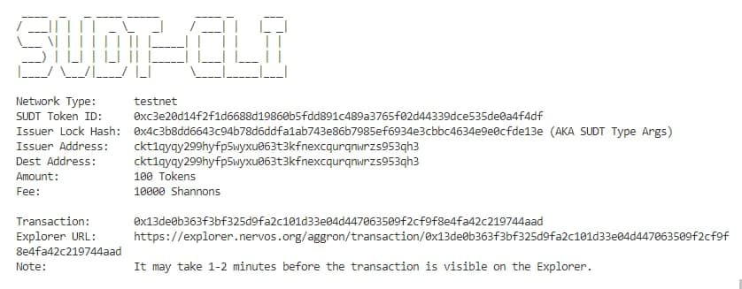
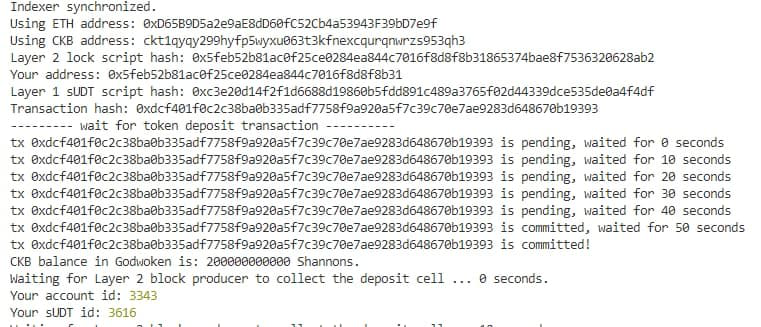

## link to the Layer 1 address you funded on the Testnet Explore

https://explorer.nervos.org/aggron/address/ckt1qyqy299hyfp5wyxu063t3kfnexcqurqnwrzs953qh3

## A screenshot of the console output immediately after using sudt-cli to create your SUDT tokens on Layer 1C

## A link to the transaction ID created by sudt-cli on the Testnet Explorer.
https://explorer.nervos.org/aggron/transaction/0x13de0b363f3bf325d9fa2c101d33e04d447063509f2cf9f8e4fa42c219744aad

## A screenshot of the console output immediately after you have successfully submitted a deposit to Layer 2 using the account-cli tool.

## The SUDT ID from the console output after executing the deposit script

3616